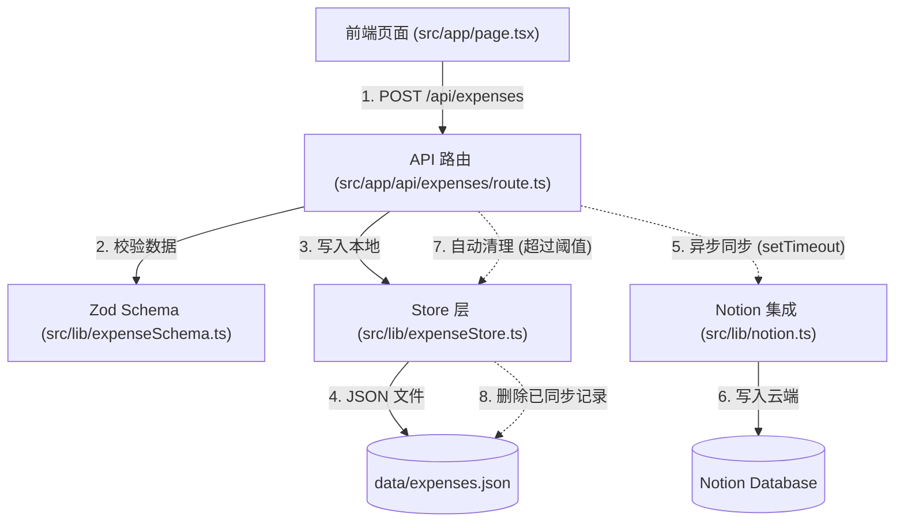

# Node.js 项目完整介绍 - MindLedger

## 一、项目整体框架（Java 类比）

### 1.1 核心框架对比

| Node.js/Next.js | Java/Spring Boot | 说明 |
|----------------|------------------|------|
| **Next.js** | **Spring Boot** | 全栈 Web 框架，提供前后端一体化开发 |
| **React** | **Thymeleaf/JSP** | 前端 UI 组件库 |
| **TypeScript** | **Java** | 带有类型系统的编程语言 |
| **package.json** | **pom.xml** | 项目依赖配置文件 |
| **tsconfig.json** | - | TypeScript 编译器配置（Java 不需要） |
| **Node.js** | **JVM** | 运行时环境 |

### 1.2 数据流向图



### 1.3 架构层次对比

```
Java/Spring Boot 架构:
┌─────────────────┐
│   Controller    │ ← 接收 HTTP 请求
├─────────────────┤
│    Service      │ ← 业务逻辑处理
├─────────────────┤
│   Repository    │ ← 数据访问层
├─────────────────┤
│   Database      │ ← 数据存储
└─────────────────┘

Node.js/Next.js 架构:
┌─────────────────┐
│  React Pages    │ ← 前端页面（src/app/page.tsx）
├─────────────────┤
│  API Routes     │ ← API 路由（src/app/api/expenses/route.ts）
├─────────────────┤
│  Business Logic │ ← 业务逻辑（src/lib/expenseStore.ts）
├─────────────────┤
│  Data Storage   │ ← 数据存储（JSON 文件或 Notion）
└─────────────────┘
```

### 1.4 项目特点

- **全栈框架**：Next.js 同时提供前端和后端功能，类似 Spring Boot
- **服务端渲染（SSR）**：在服务器端渲染页面，提高首屏加载速度
- **API Routes**：内置 API 路由，无需单独搭建后端服务器
- **类型安全**：TypeScript 提供编译时类型检查，类似 Java 的强类型
- **本地优先**：数据先落盘本地 JSON，异步同步云端，保证极致的手机端交互手感
- **自动清理**：通过 `notionSyncedAt` 标记位自动管理本地存储空间

---

## 二、技术栈详解

### 2.1 核心依赖（package.json）

```json
{
  "dependencies": {
    "@notionhq/client": "^5.6.0",    // Notion API 客户端
    "framer-motion": "^12.24.12",    // React 动画库
    "next": "16.1.1",                 // Next.js 框架（核心）
    "react": "19.2.3",               // React UI 库
    "react-dom": "19.2.3",           // React DOM 渲染
    "zod": "^4.3.5"                  // 数据校验库（类似 Hibernate Validator）
  }
}
```

| Node.js/Next.js | Java/Spring Boot | 说明 |
|----------------|------------------|------|
| `next` | Spring Boot Starter Web | 核心 Web 框架 |
| `react` | Thymeleaf + 前端框架 | UI 构建库 |
| `zod` | Hibernate Validator | 数据校验（Bean Validation） |
| `framer-motion`| - | 声明式动画库，用于实现流畅的交互体验 |
| `@notionhq/client` | Notion SDK | 第三方服务集成 |

### 2.2 开发依赖

```json
{
  "devDependencies": {
    "@tailwindcss/postcss": "^4",    // Tailwind CSS PostCSS 插件
    "@types/node": "^20",            // Node.js 类型定义
    "@types/react": "^19",           // React 类型定义
    "@types/react-dom": "^19",       // React DOM 类型定义
    "eslint": "^9",                  // 代码检查工具（类似 Checkstyle）
    "eslint-config-next": "16.1.1",  // Next.js ESLint 配置
    "tailwindcss": "^4",             // CSS 框架
    "typescript": "^5"               // TypeScript 编译器
  }
}
```

**说明：**
- `@types/*` → Java 不需要，因为 Java 本身就有类型系统
- `eslint` → Checkstyle / SonarQube
- `tailwindcss` → Bootstrap / Material UI
- `typescript` → Java 编译器（javac）

---

## 三、目录结构详解

```
mindledger-cursor/
├── data/                          # 数据存储目录
│   └── expenses.example.json      # 数据示例文件
├── public/                        # 静态资源目录（类似 Java 的 static/）
│   ├── file.svg
│   ├── globe.svg
│   ├── next.svg
│   ├── vercel.svg
│   └── window.svg
├── src/                           # 源代码目录
│   ├── app/                       # Next.js App Router（核心）
│   │   ├── api/                   # API 路由（后端）
│   │   │   └── expenses/
│   │   │       ├── cleanup/       
│   │   │       │   └── route.ts   # 存储清理 API
│   │   │       └── route.ts       # 消费记录增删改查 API
│   │   ├── favicon.ico            # 网站图标
│   │   ├── globals.css            # 全局样式
│   │   ├── layout.tsx             # 根布局组件
│   │   └── page.tsx               # 首页组件
│   ├── components/                # React 组件目录
│   │   └── bubbles/
│   │       ├── Bubble.tsx         # 气泡组件
│   │       ├── layout.ts          # 布局工具
│   │       ├── types.ts           # 类型定义
│   │       └── useContainerSize.ts # 自定义 Hook
│   └── lib/                       # 工具库（类似 Java 的 util/）
│       ├── expenseSchema.ts       # 数据模型和校验
│       ├── expenseStore.ts        # 数据存储层
│       └── notion.ts              # Notion 集成
├── .gitignore                     # Git 忽略文件
├── README.md                      # 项目说明文档
├── eslint.config.mjs              # ESLint 配置
├── next.config.ts                 # Next.js 配置
├── notion.env.example             # Notion 环境变量模板
├── package.json                   # 项目依赖配置（类似 pom.xml）
├── package-lock.json              # 依赖版本锁定（类似 pom.xml.lock）
├── postcss.config.mjs             # PostCSS 配置
└── tsconfig.json                  # TypeScript 配置
```

### 3.1 与 Java 项目对比

```
Java Maven 项目结构:
src/
├── main/
│   ├── java/
│   │   └── com/example/app/
│   │       ├── controller/        # 控制器层
│   │       ├── service/          # 服务层
│   │       ├── repository/       # 数据访问层
│   │       └── model/            # 数据模型
│   └── resources/
│       ├── static/               # 静态资源
│       └── templates/            # 模板文件
└── test/
    └── java/

Node.js/Next.js 项目结构:
src/
├── app/                          # 页面和 API 路由
│   ├── page.tsx                  # 页面（类似 Controller + View）
│   └── api/                      # API 路由（类似 Controller）
├── components/                   # React 组件（类似 View）
└── lib/                          # 业务逻辑（类似 Service + Repository）
```

---

## 四、核心文件详解

### 4.1 package.json（项目配置）

**作用**：类似 Java 的 `pom.xml`，定义项目依赖和脚本

```json
{
  "name": "mindledger-cursor",           // 项目名称
  "version": "0.1.0",                     // 版本号
  "private": true,                       // 私有项目（不发布到 npm）
  "scripts": {                           // 可执行脚本
    "dev": "next dev",                   // 启动开发服务器
    "build": "next build",               // 构建生产版本
    "start": "next start",               // 启动生产服务器
    "lint": "eslint"                     // 代码检查
  },
  "dependencies": { ... },               // 运行时依赖
  "devDependencies": { ... }             // 开发时依赖
}
```

**生成方式**：执行 `npm init` 或使用 `create-next-app` 自动生成

### 4.2 tsconfig.json（TypeScript 配置）

**作用**：配置 TypeScript 编译器，类似 Java 的编译器选项

```json
{
  "compilerOptions": {
    "target": "ES2017",                  // 编译目标（类似 Java 版本）
    "lib": ["dom", "dom.iterable", "esnext"],  // 包含的库
    "allowJs": true,                     // 允许导入 JS 文件
    "strict": true,                      // 启用严格类型检查
    "module": "esnext",                  // 模块系统
    "moduleResolution": "bundler",       // 模块解析方式
    "jsx": "react-jsx",                  // JSX 转换方式
    "paths": {
      "@/*": ["./src/*"]                 // 路径别名（类似 Java 的 import 别名）
    }
  }
}
```

**生成方式**：执行 `tsc --init` 或使用 `create-next-app` 自动生成

### 4.3 next.config.ts（Next.js 配置）

**作用**：配置 Next.js 框架，类似 Spring Boot 的 `application.properties`

```typescript
import type { NextConfig } from "next";

const nextConfig: NextConfig = {
  /* config options here */
};

export default nextConfig;
```

**生成方式**：使用 `create-next-app` 自动生成

### 4.4 src/app/layout.tsx（根布局）

**作用**：类似 Java 的 `layout.html` 或 Thymeleaf 模板，定义页面通用结构

```typescript
import type { Metadata } from "next";
import "./globals.css";

export const metadata: Metadata = {
  title: "MindLedger｜个人日常消费记录",
  description: "一个简洁的个人日常消费记录项目",
};

export default function RootLayout({
  children,
}: Readonly<{
  children: React.ReactNode;
}>) {
  return (
    <html lang="zh-CN">
      <body className="antialiased">{children}</body>
    </html>
  );
}
```

**生成方式**：使用 `create-next-app` 自动生成

### 4.5 src/app/page.tsx（首页）

**作用**：首页组件，类似 Java 的 `@Controller` + Thymeleaf 模板。

**项目亮点**：
- **极速记账交互**：针对移动端优化，支持根据时间段（早、中、晚）智能预设分类，并提供大额数字点选键盘。
- **流畅动画**：集成 `framer-motion`，实现状态切换时的丝滑过渡动画（类似 Native App 体验）。

```typescript
"use client";  // 标记为客户端组件，支持 React Hooks 和浏览器 API

import { motion, AnimatePresence } from "framer-motion";

export default function Home() {
  // ... 状态管理逻辑
  return (
    <motion.div initial={{ opacity: 0 }} animate={{ opacity: 1 }}>
       {/* 响应式布局内容 */}
    </motion.div>
  );
}
```

### 4.6 src/app/api/expenses/route.ts（API 路由）

**作用**：API 路由，类似 Java 的 `@RestController`。

**核心逻辑**：
1. **数据校验**：使用 Zod 验证请求体。
2. **本地落盘**：先写入本地 JSON，确保响应速度（201 Created）。
3. **后台异步**：通过 `setTimeout(..., 0)` 开启后台任务，不阻塞主线程：
   - **Notion 同步**：将数据同步至 Notion 云端，成功后标记 `notionSyncedAt`。
   - **自动清理**：检查本地已同步记录数，超过阈值（默认 100 条）则自动删除。

```typescript
export async function POST(req: Request) {
  const body = await req.json();
  const record = await addExpense(body); // 1. 先存本地
  
  // 2. 后台异步执行同步和清理（不 await）
  setTimeout(() => {
    syncToNotion(record); 
    checkAndCleanup();
  }, 0);

  return NextResponse.json({ ok: true }, { status: 201 });
}
```

### 4.7 src/lib/expenseSchema.ts（数据模型和校验）

**作用**：定义数据模型和校验规则，类似 Java 的 `@Entity` + `@Valid`

```typescript
import { z } from "zod";

export const expenseInputSchema = z.object({
  amount: z.number().positive("金额必须大于 0"),
  currency: z.string().default("CNY"),
  category: z.string().min(1, "分类不能为空"),
  date: z.string().refine(isValidYyyyMmDd),
  note: z.string().max(200).optional(),
  tags: z.array(z.string()).max(10).optional(),
});

export type ExpenseInput = z.infer<typeof expenseInputSchema>;
```

**与 Java 对比**：
```java
public class ExpenseInput {
    @Positive(message = "金额必须大于 0")
    private BigDecimal amount;

    @NotBlank(message = "分类不能为空")
    private String category;

    @Pattern(regexp = "^\\d{4}-\\d{2}-\\d{2}$", message = "日期格式不正确")
    private String date;

    @Size(max = 200)
    private String note;

    @Size(max = 10)
    private List<String> tags;
}
```

**生成方式**：手动创建

### 4.8 src/lib/expenseStore.ts（数据存储层）

**作用**：数据访问层，类似 Java 的 `@Repository`。

**核心功能**：
- `addExpense`: 写入新记录，生成 UUID。
- `markExpenseNotionSynced`: 标记记录已同步。
- `cleanupSyncedExpenses`: **核心清理逻辑**。删除所有已同步（有 `notionSyncedAt`）的记录，保留本地存储的精简。

```typescript
// 清理逻辑示例
export async function cleanupSyncedExpenses() {
  const db = await readDb();
  // 仅保留未同步记录（类似备份）
  db.items = db.items.filter(item => !item.notionSyncedAt);
  await writeDb(db);
}
```

### 4.9 src/lib/notion.ts（Notion 集成）

**作用**：Notion API 集成，类似 Java 的第三方 SDK 调用

```typescript
import { Client } from "@notionhq/client";

export async function createNotionExpense(expense: ExpenseRecord) {
  const client = new Client({ auth: process.env.NOTION_TOKEN });
  const res = await client.pages.create({
    parent: { database_id: process.env.NOTION_DATABASE_ID },
    properties: toNotionProperties(expense),
  });
  return { pageId: res.id, url: res.url };
}
```

**生成方式**：手动创建

---

## 五、文件生成方式

### 5.1 项目初始化

**命令**：
```bash
npx create-next-app@latest mindledger-cursor
```

**生成的文件**：
- `package.json`
- `tsconfig.json`
- `next.config.ts`
- `postcss.config.mjs`
- `eslint.config.mjs`
- `src/app/layout.tsx`
- `src/app/page.tsx`
- `src/app/globals.css`
- `public/` 目录及图标文件

**交互选项**：
```
Would you like to use TypeScript? Yes
Would you like to use ESLint? Yes
Would you like to use Tailwind CSS? Yes
Would you like to use `src/` directory? Yes
Would you like to use App Router? Yes
Would you like to customize the default import alias? No
```

### 5.2 手动创建的文件

| 文件 | 创建方式 | 说明 |
|------|---------|------|
| `src/app/api/expenses/route.ts` | 手动创建 | API 路由 |
| `src/app/api/expenses/cleanup/route.ts` | 手动创建 | 清理路由 |
| `src/lib/expenseSchema.ts` | 手动创建 | 数据模型 |
| `src/lib/expenseStore.ts` | 手动创建 | 数据存储 |
| `src/lib/notion.ts` | 手动创建 | Notion 集成 |
| `data/expenses.example.json` | 手动创建 | 数据示例 |
| `notion.env.example` | 手动创建 | 环境变量模板 |

### 5.3 依赖安装

**命令**：
```bash
npm install @notionhq/client framer-motion zod
npm install -D @types/node @types/react @types/react-dom tailwindcss
```

**生成的文件**：
- `package-lock.json`（依赖版本锁定）

---

## 六、运行流程详解

### 6.1 开发模式启动

**命令**：
```bash
npm run dev
```

**流程**：
1. 读取 `package.json` 中的 `scripts.dev` 配置
2. 执行 `next dev` 命令
3. Next.js 启动开发服务器（默认端口 3000）
4. 监听文件变化，自动重新编译

**与 Java 对比**：
```bash
# Java/Spring Boot
mvn spring-boot:run
# 或
./mvnw spring-boot:run
```

### 6.2 请求处理流程

```
用户访问 http://localhost:3000
    ↓
Next.js 路由系统 (src/app/page.tsx)
    ↓
用户提交表单 (framer-motion 动画反馈)
    ↓
fetch("/api/expenses", { method: "POST" })
    ↓
API 路由校验 (Zod Schema)
    ↓
写入本地存储 (expenseStore.addExpense)
    ↓
立即返回 201 响应 (UI 显示成功提示)
    ↓
开启后台任务 (setTimeout 0)
    ├──────────────────────────┐
    ↓                          ↓
Notion 同步 (notion.ts)    检查自动清理阈值
    ↓                          ↓
标记 notionSyncedAt        执行 cleanupSyncedExpenses
```

### 6.3 构建生产版本

**命令**：
```bash
npm run build
```

**流程**：
1. TypeScript 编译（检查类型错误）
2. React 组件编译
3. 代码分割和优化
4. 生成 `.next/` 目录（构建产物）

**与 Java 对比**：
```bash
# Java/Maven
mvn clean package
# 生成 target/*.jar
```

### 6.4 生产环境运行

**命令**：
```bash
npm start
```

**流程**：
1. 启动生产服务器
2. 加载 `.next/` 目录中的构建产物
3. 提供静态资源和服务端渲染

**与 Java 对比**：
```bash
# Java
java -jar target/app.jar
```

---

## 七、关键概念对比

### 7.1 模块系统

**Node.js (ES Modules)**：
```typescript
// 导出
export function addExpense() {}
export const schema = z.object({});

// 导入
import { addExpense, schema } from "@/lib/expenseStore";
```

**Java**：
```java
// 导出（默认 public）
public class ExpenseService {
    public void addExpense() {}
}

// 导入
import com.example.service.ExpenseService;
```

### 7.2 异步编程

**Node.js (async/await)**：
```typescript
export async function addExpense(input: ExpenseInput) {
  const db = await readDb();  // 等待异步操作
  db.items.unshift(record);
  await writeDb(db);
  return record;
}
```

**Java**：
```java
public CompletableFuture<Expense> addExpense(ExpenseInput input) {
    return readDb().thenCompose(db -> {
        db.getItems().addFirst(record);
        return writeDb(db).thenApply(v -> record);
    });
}

// 或使用同步方式
public Expense addExpense(ExpenseInput input) {
    ExpenseDb db = readDb();  // 阻塞等待
    db.getItems().addFirst(record);
    writeDb(db);
    return record;
}
```

### 7.3 类型定义

**Node.js (TypeScript)**：
```typescript
export type ExpenseInput = {
  amount: number;
  category: string;
  date: string;
};
```

**Java**：
```java
public class ExpenseInput {
    private BigDecimal amount;
    private String category;
    private LocalDate date;

    // getters and setters
}
```

### 7.4 数据校验

**Node.js (Zod)**：
```typescript
const schema = z.object({
  amount: z.number().positive("金额必须大于 0"),
  category: z.string().min(1, "分类不能为空"),
});

const result = schema.safeParse(input);
if (!result.success) {
  console.log(result.error.errors);
}
```

**Java (Bean Validation)**：
```java
public class ExpenseInput {
    @Positive(message = "金额必须大于 0")
    private BigDecimal amount;

    @NotBlank(message = "分类不能为空")
    private String category;
}

// 使用
Validator validator = Validation.buildDefaultValidatorFactory().getValidator();
Set<ConstraintViolation<ExpenseInput>> violations = validator.validate(input);
```

---

## 八、环境变量配置

### 8.1 环境变量文件

**文件**：`.env.local`（不提交到 Git）

**内容**：
```env
NOTION_TOKEN=secret_xxxxxxxxxxxxxxxxxxxxxxxxxxxxxxxxxxxxxxxxxxxx
NOTION_DATABASE_ID=xxxxxxxxxxxxxxxxxxxxxxxxxxxxxxxx
NOTION_TITLE_PROPERTY=Name
```

**与 Java 对比**：
```properties
# application.properties
notion.token=secret_xxxxxxxxxxxxxxxxxxxxxxxxxxxxxxxxxxxxxxxxxxxx
notion.database-id=xxxxxxxxxxxxxxxxxxxxxxxxxxxxxxxx
notion.title-property=Name
```

### 8.2 使用环境变量

**Node.js**：
```typescript
const token = process.env.NOTION_TOKEN;
```

**Java**：
```java
@Value("${notion.token}")
private String token;
```

---

## 九、总结

### 9.1 Node.js vs Java 核心差异

| 特性 | Node.js/Next.js | Java/Spring Boot |
|------|----------------|------------------|
| **语言** | TypeScript（编译为 JS） | Java（编译为字节码） |
| **运行时** | Node.js（V8 引擎） | JVM |
| **类型系统** | TypeScript（可选） | Java（强类型） |
| **模块系统** | ES Modules | Java Packages |
| **异步模型** | 事件循环（非阻塞 I/O） | 线程池（阻塞 I/O） |
| **前端集成** | React + Next.js（一体化） | Thymeleaf + 前端框架（分离） |
| **配置文件** | package.json, tsconfig.json | pom.xml, application.properties |
| **构建工具** | Next.js, Webpack | Maven, Gradle |

### 9.2 学习建议

1. **先理解核心概念**：
   - 模块系统（import/export）
   - 异步编程（async/await）
   - 类型系统（TypeScript）

2. **从简单到复杂**：
   - 先学习 React 组件
   - 再学习 API 路由
   - 最后学习数据存储和集成

3. **对比学习**：
   - 将 Next.js 类比为 Spring Boot
   - 将 React 类比为 Thymeleaf
   - 将 Zod 类比为 Bean Validation

4. **实践项目**：
   - 修改现有功能
   - 添加新功能
   - 部署到生产环境

### 9.3 下一步学习

1. **深入学习 Next.js**：
   - App Router
   - Server Components vs Client Components
   - 数据获取（fetch, Server Actions）

2. **学习 React**：
   - Hooks（useState, useEffect, useMemo）
   - 组件生命周期
   - 状态管理（Context, Redux）

3. **学习 TypeScript**：
   - 类型系统
   - 泛型
   - 高级类型

4. **学习 Node.js**：
   - 文件系统（fs）
   - HTTP 模块
   - 异步编程模式

---

## 十、参考资料

- [Next.js 官方文档](https://nextjs.org/docs)
- [React 官方文档](https://react.dev)
- [TypeScript 官方文档](https://www.typescriptlang.org/docs)
- [Node.js 官方文档](https://nodejs.org/docs)
- [Zod 文档](https://zod.dev)
- [Tailwind CSS 文档](https://tailwindcss.com)
